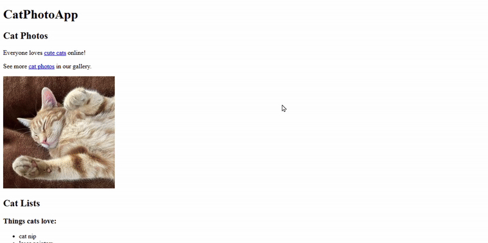
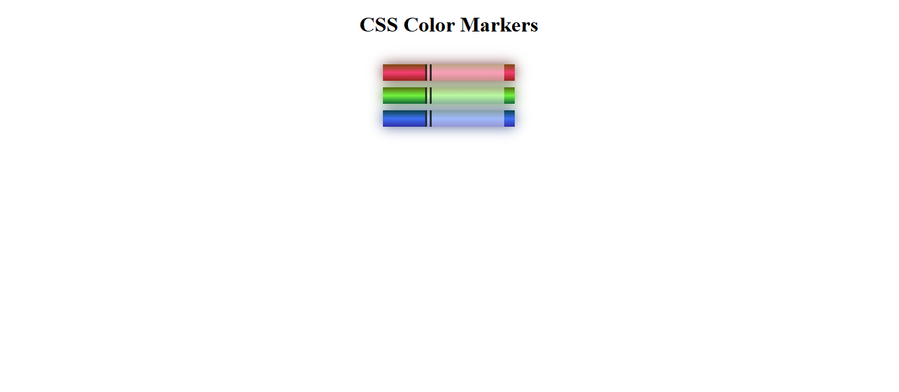
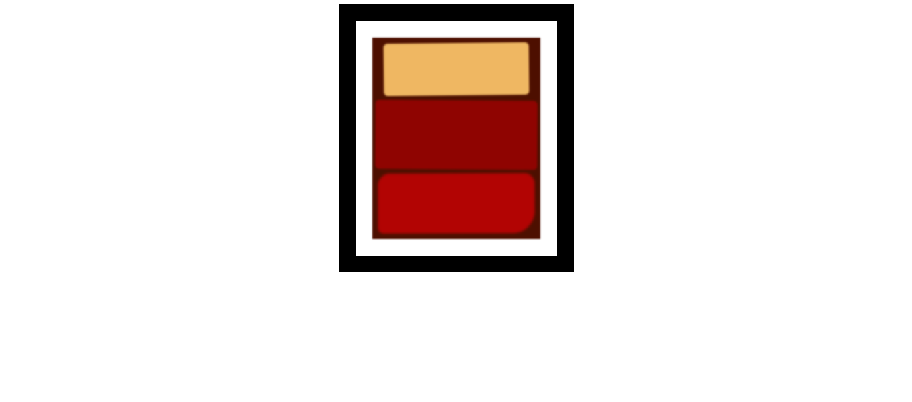
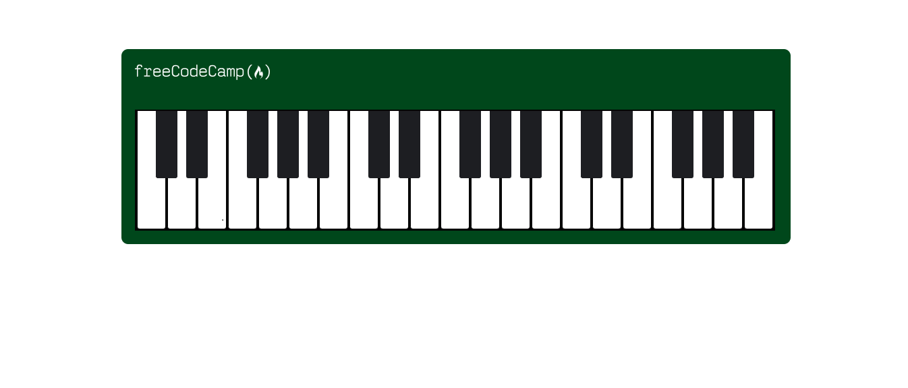
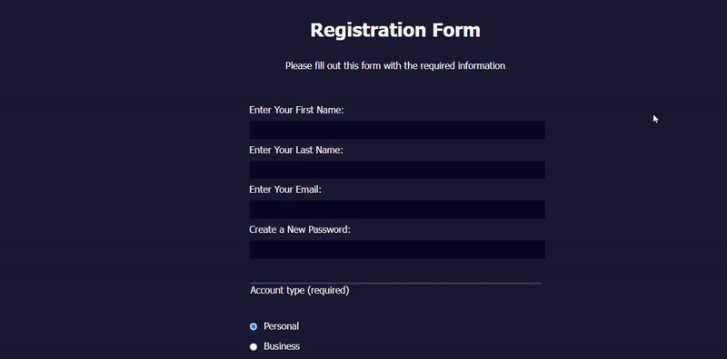
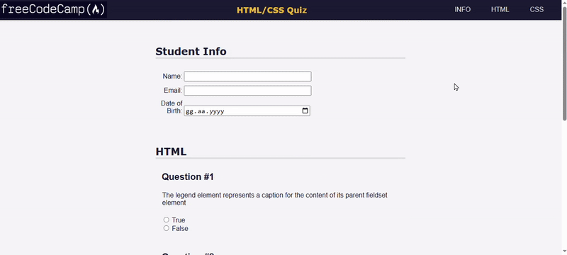
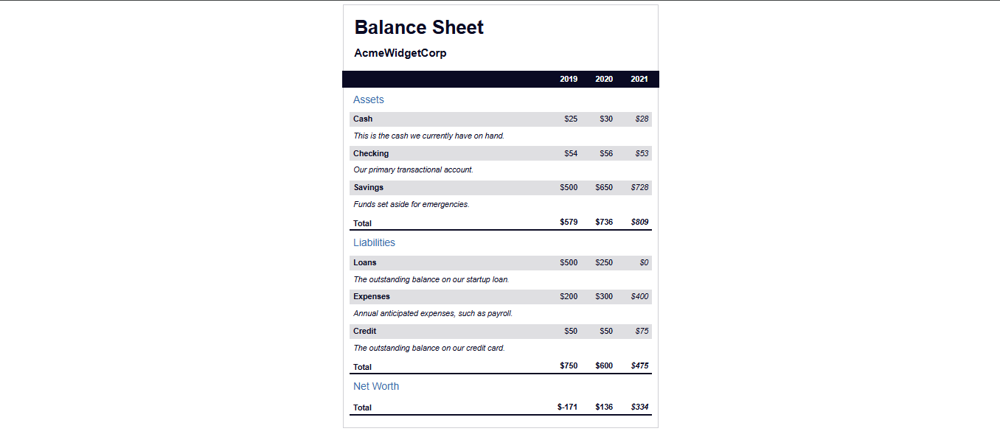
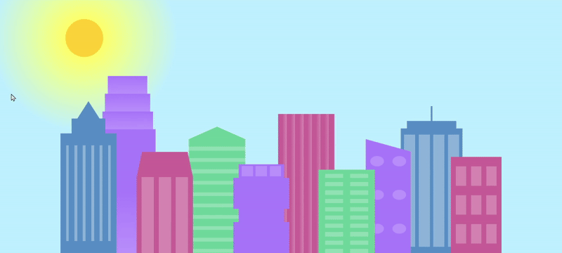
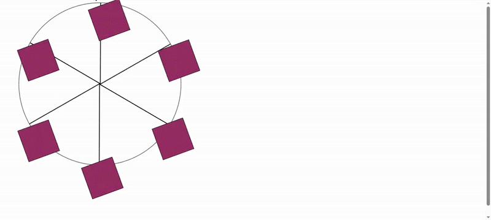
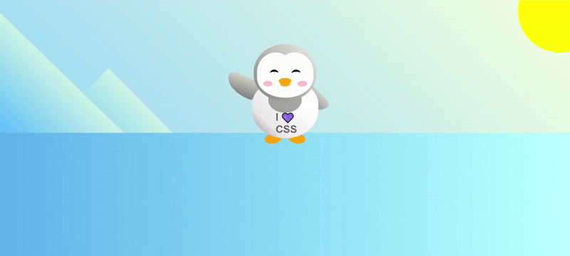

<p align="center">
  <a href="https://github.com/busrademirell/freecodecamp-projects/blob/master/README.md">
    
  </a>
  <a href="https://github.com/busrademirell/freecodecamp-projects/blob/master/doc/tr/README_tr.md">
    
  </a>
</p>

# FreeCodeCamp Projects

This repository is a collection of various web development projects completed on the FreeCodeCamp platform. The goal is to reinforce skills gained during the courses and create practical applications.

## 📂 Contents

1. 🐱 **CatPhotoApp** – A simple app for learning basic HTML tags.
2. 🎨 **A Set of Colored Markers** – A small design project to practice working with colors using CSS.
3. 🖼️ **A Rothko Painting** – An artistic work using the CSS box model.
4. 📝 **A Registration Form** – A registration form page demonstrating form elements and input types.
5. ❓ **HTML/CSS Quiz** – A Q&A style page to reinforce HTML and CSS knowledge.
6. 🎹 **A Piano** – An interactive piano interface designed with HTML and CSS.
7. 🖼️ **CSS Flexbox Photo Gallery** – A photo gallery created to practice the Flexbox layout.
8. 🐧 **A Penguin** – A penguin drawing project created with CSS shapes.
9. 🥗 **A Nutrition Label** – A design of a product label showing nutritional values.
10. 📖 **A Magazine** – A magazine-style page demonstrating typography and layout.
11. 🎡 **A Ferris Wheel** – A Ferris wheel animation created using CSS animations.
12. 🌆 **A City Skyline** – A city skyline design with day/night theme.
13. 🎨 **A Cat Painting** – A minimalist cat illustration created with CSS.
14. ☕ **A Café Menu** – A menu design demonstrating typography and layout.
15. 📊 **Balance Sheet** – A simple financial table design using HTML tables and CSS.

## 🎯 Goals

- Start with basic web pages and gradually progress to more complex applications
- Develop responsive and user-friendly designs
- Gain practical experience during the learning process and build a portfolio
- Make each project independently usable as a learning resource

## 🛠️ Technologies Used

- **HTML5** – Used for page structure and content layout
- **CSS3** – Applied for styling and design adjustments
- **JavaScript (ES6+)** – Used to add dynamic and interactive features
- **FreeCodeCamp Learning Materials** – Used as a reference and guide for projects

🚀 Installation & Running

1. Clone the repository to your computer:

```bash
git clone https://github.com/busrademirell/freecodecamp-projects.git
```

2. Navigate to the specific project folder:

```bash
cd proje-adi
```

3. Open the index.html file in your browser to view the project.

## 📸 Screenshots

### Cat Photo App



### A Set Of Colored Markers



### A Rothko Painting



### A Piano



### A Registration Form



### A Quiz



### A Balance Sheet



### A Cat Painting


### a-photo-gallery


### a-magazine


### A Balance Sheet


### A City Skyline



### A Cafe Menu


### A Ferris Wheel



### A Penguin


